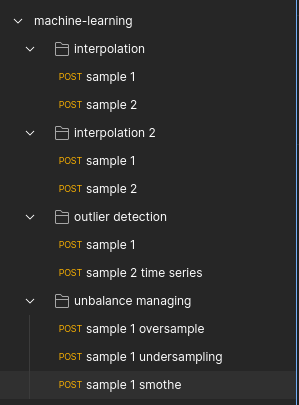
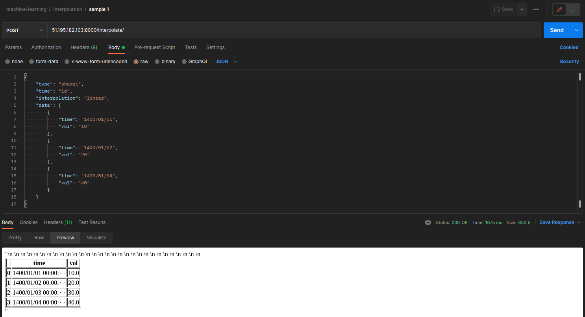

# Machine learning final project

name: ali aliabadi  
sid: 97222061

## How to run
1. create a file with name `ml_secrets.py` in 
machine_learning directory. then create `SECRET_KEY` 
variable which contain a secret string (can be anything).
the file content is like below
    ```python
    SECRET_KEY = 'django-insecure-f6u$^jrx802-rc)1xv23z&8rxjcg9s9oixriiz5-sldfkjj6(@'
    ```
2. run this command `docker-compose up`
3. project is up on `localhost:8888`

## Postman collection
* import postman collection (v2.1) in assets folder 
(`machine-learning.postman_collection.json`)
into postman. 
* collection contains 9 samples for different methods 
and different APIs and looks like below.  

* each request should work with no change as project is 
running on cloud (ip: `51.195.182.103:8000`). like below  

* for better readability servers response are in form of html 
so like above choose preview in response section for prettify
response.
* all request bodies are json and can be change like in 
body section but be sure to not change keys. (more explain later)

## APIs
### `interpolate/`
#### Parameters
1. type (`shamsi`/`miladi`)
2. time (`1h`/`1d`/`1w`/`1M`)
3. interpolation (`linear`, `time`, `index`, `pad`, `from_derivatives`, `nearest`, 
`zero`, `slinear`, `quadratic`, `cubic`, `spline`, `barycentric`, `polynomial`,
`krogh`, `piecewise_polynomial`, `spline`, `pchip`, `akima`, `cubicspline`)
4. data: a json of a dataframe (list of dictionaries) containing
column time and other columns like volume

#### More
all more score parts has been implemented

#### Response
interpolated data in form of html table

### `interpolate2/`
#### Parameters
1. time (`1h`/`1d`/`1w`/`1M`)
2. interpolation (`linear`, `time`, `index`, `pad`, `from_derivatives`, `nearest`, 
`zero`, `slinear`, `quadratic`, `cubic`, `spline`, `barycentric`, `polynomial`,
`krogh`, `piecewise_polynomial`, `spline`, `pchip`, `akima`, `cubicspline`)
3. skip_holiday: a boolean to skip `friday` and `saturday` on daily interval
4. data: a json of a dataframe (list of dictionaries) containing
column time and other columns like volume

#### More
all more score parts has been implemented

#### Response
interpolated data in form of html table


### `outlier/`
#### Parameters
1. time_series: a boolean config showing whether data is time series or not 
2. data: a json of a dataframe (list of dictionaries)  
if its time series then there must be a column time.

#### More
all more score parts has been implemented

#### Response
some columns will be added to dataframe that its name is the
method which was used to determine outliers and its value (`true`/`false`)
represent if the row is an outlier or not.

#### Methods used
* **normal_isolation_forest**: default parameter values
* **normal_local_outlier_factor_(KNN)**:  
   `n_neighbour=2, leaf_size=2` for the sake of easy/little inputs data
* **normal_one_class_svm**: default parameter values
* **normal_minimum_covariance_determinant**: default value parameters
* **time_series_derivative**: here we calculate the derivative
between 2 sequential points for all data and create a new column
for it. the normalize it by max and mark rows with values more than
`4.8` for this new column as outlier
* **time_series_isolation_forest**
* **time_series_local_outlier_factor_(KNN)**
* **time_series_one_class_svm**

#### Links
* [normal (not time seri)](https://machinelearningmastery.com/model-based-outlier-detection-and-removal-in-python/)
* [time series derivative idea](https://stats.stackexchange.com/questions/427327/simple-outlier-detection-for-time-series)
* [time series](https://neptune.ai/blog/anomaly-detection-in-time-series)


### `unbalance/`
#### Parameters
* major_class_tag: one target class tag
* minor_class_tag: one target class tag
* method: one of `undersampling`, `oversampling`, `smothe`
* data: a json of a dataframe (list of dictionaries) it must 
have a column with name target which contain class tags

#### Response
generated dataframe in form of html table

#### Methods
random sampler methods

#### Links
* [basic](https://www.kaggle.com/code/residentmario/undersampling-and-oversampling-imbalanced-data/notebook)
* [codes](https://medium.com/grabngoinfo/four-oversampling-and-under-sampling-methods-for-imbalanced-classification-using-python-7304aedf9037)


## Swagger
there is no swagger but instead use postman collection 
which contain rich tests and samples.  
load collection for sample and testing and use this readme for
explanation


